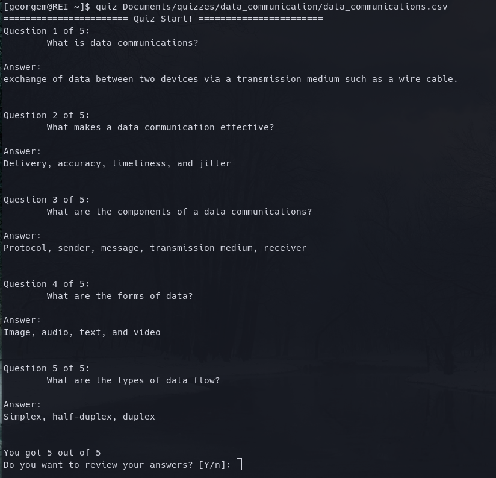
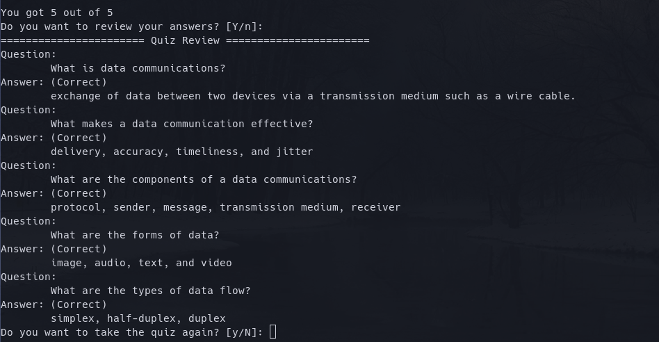
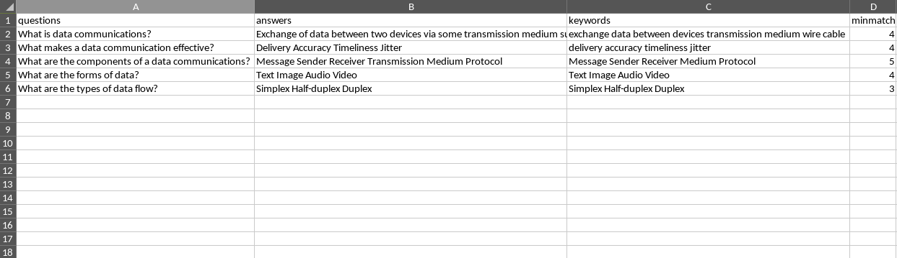

# Quizzer
CLI quizzer tool. Made to help me with my studies. I added some sample quizzes in this repository.

# Dependencies
* python (3.5+)

# Usage
## Add script to path
- Linux (bash)
```bash
# add this to your .bashrc file
# change file permission of the script first
chmod +x path/to/quiz
export PATH=$PATH:path/to/quiz
```
## Create a quiz file
The quiz file must be in .csv format with the corresponding columns in order:

| questions     |    answers    |        keywords         |    minmatch   |
| ------------- | ------------- | ----------------------- | ------------- | 
| string        | string        | space separated strings | int           |

See quiz samples in `/sample`

## Run
```bash
quiz path/to/quiz/file
```
# Screenshots
## Running quiz in the terminal



## Sample CSV File



